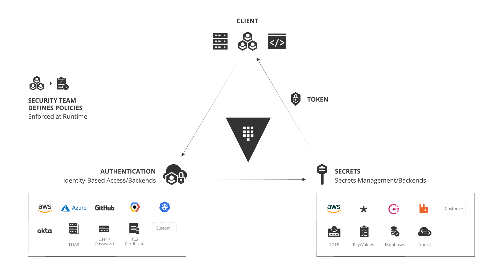
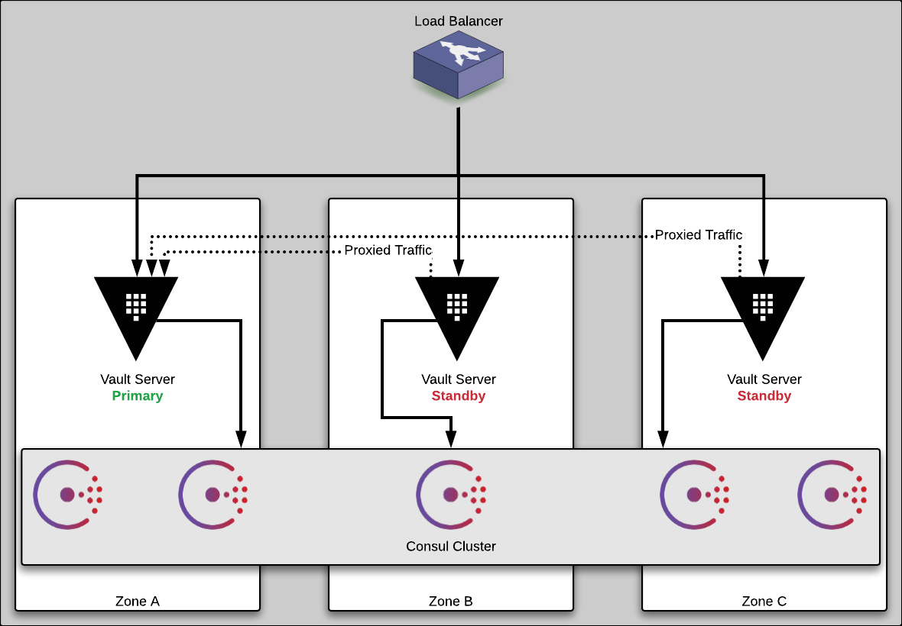

name: vault-title-slide
class: title, no-footer
count: false

.center[
Install a Vault Cluster on AWS 
In About Five Minutes
]

---
layout: true

.footer[
- Copyright © 2020 HashiCorp
- 
]

---
name: intro-slide
.center[
 
My First Computer - the C64
]

---
name: hashiCorp-vault-overview

---
name: hashiCorp-vault-overview

  * API-driven, multi-cloud secrets management system

---
name: hashiCorp-vault-overview

  * API-driven, multi-cloud secrets management system
  * Store and manage passwords and certificates

---
name: hashiCorp-vault-overview

  * API-driven, multi-cloud secrets management system
  * Store and manage passwords and certificates
  * Dynamic credentials for applications and cloud environments

---
name: hashiCorp-vault-overview

  * API-driven, multi-cloud secrets management system
  * Store and manage passwords and certificates
  * Dynamic credentials for applications and cloud environments
  * Encrypt and decrypt data with a standard API

---
name: hashiCorp-vault-overview

  * API-driven, multi-cloud secrets management system
  * Store and manage passwords and certificates
  * Dynamic credentials for applications and cloud environments
  * Encrypt and decrypt data with a standard API
  * Manage PKI Infrastructure

---
name: hashiCorp-vault-overview

  * API-driven, multi-cloud secrets management system
  * Store and manage passwords and certificates
  * Dynamic credentials for applications and cloud environments
  * Encrypt and decrypt data with a standard API
  * Manage PKI Infrastructure
  * ...and much more!

---
name: the-old-way
# The Traditional Security Model
.center[]
.center[Also known as the Castle and Moat method.]

---
name: the-new-way
# Modern Secrets Management
.center[]
.center[No well defined perimeter; security enforced by identity.]

---
name: identity-based-security-1
#Identity Based Security
.center[]

---
name: secrets-engines
# Vault Secrets Engines
.center[]

---
name: vault-reference-architecture-1
# Vault Architecture Internals
.center[]

---
name: vault-reference-architecture-2
# Vault Architecture - High Availability
.center[]

---
name: live-demo
class: title
# Live Demo
